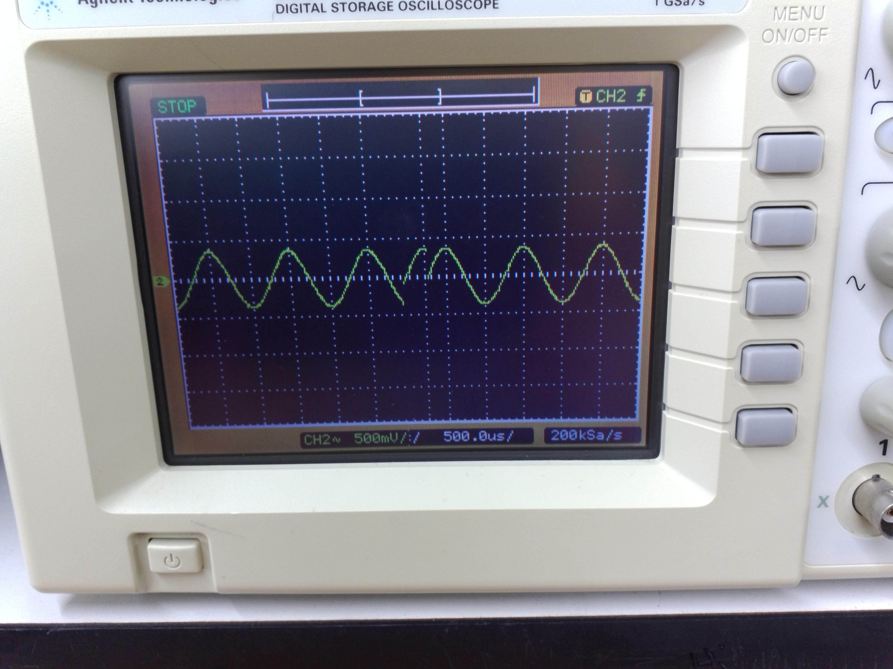

<h2>Lab 3: Common Emitter Amplifier</h2>

<b>Assembly and Testing:</b>
- Wire the amplifier circuit based on your design.
  <figure> <figcaption>Fig 1. General Circuit</figcaption></figure>
  <figure> <figcaption>Fig 2. Circuit that goes on the breadboard</figcaption></figure>
  <figure> <figcaption>Fig 3. Oscilloscope, Waveform Generator, and DC supply connections</figcaption></figure>
- Measure VE, VB, and VC in quiescent conditions.
- Apply a small sinusoidal input signal and measure small-signal voltage gain, quiescent current, and -3dB frequency.
  <figure> <figcaption>Fig 4. Kinda what it should look like</figcaption></figure>
- Measure input and output impedances (Rin and Rout).
- Take precautions against oscillation in high-gain circuits.
  

<b>Fine Tuning:</b>

- Adjust the circuit if measurements don't match the design parameters.
- Consider replacing or adding resistors.
- Introduce a trimming resistor for convenient tuning.

<b>Report:<b>

- Compare measured values with design parameters.
- Describe any circuit adjustments made during fine-tuning.
- Compare measurements with Multisim simulation results.
- Compare calculated and measured values of input and output impedances.

<b>Improvements in the circuit:</b>

- Consider expanding the circuit by adding more stages (transistors).
- To increase input impedance, you can add a buffer stage or a high-value resistor in series with the input.
- To decrease output impedance, use emitter followers or voltage followers in the output stage.
